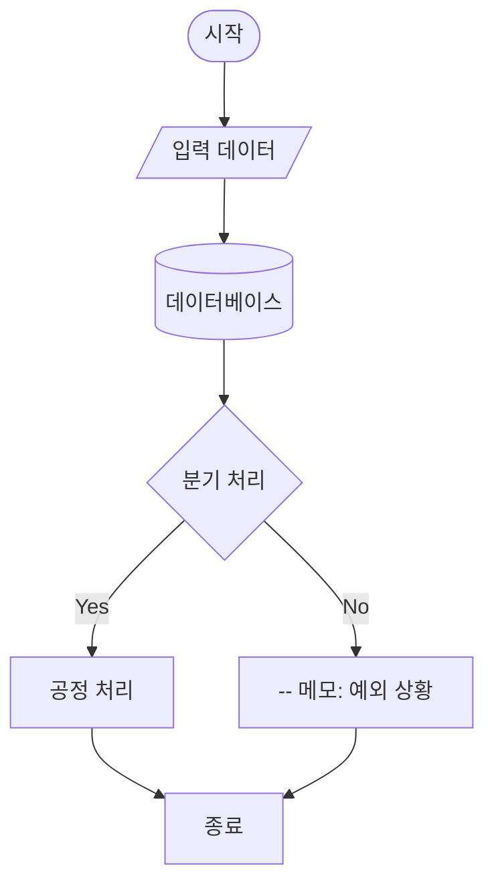
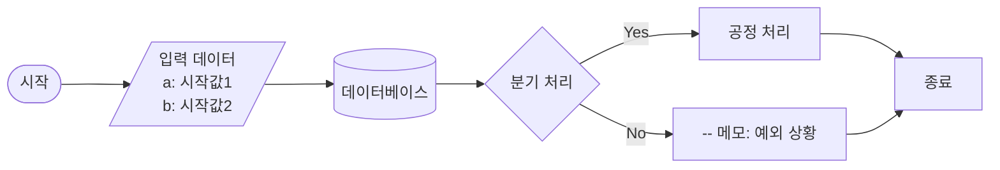
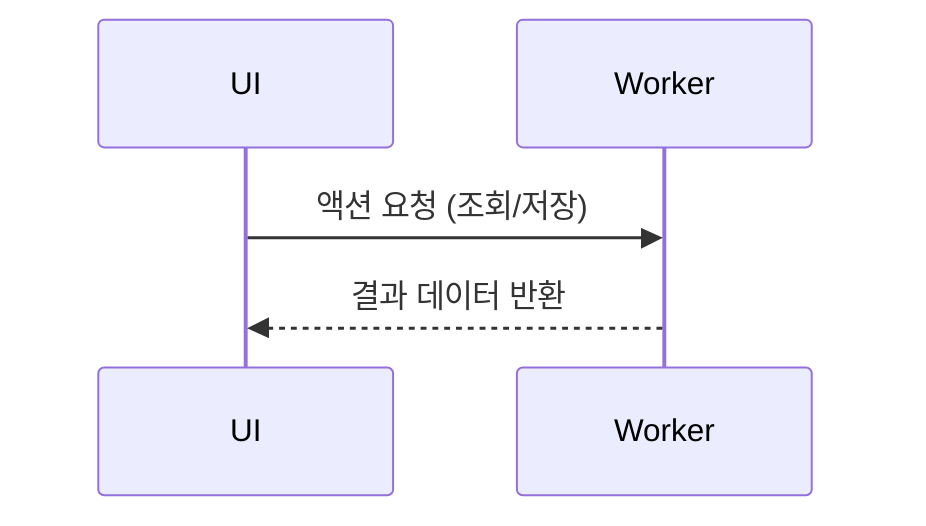
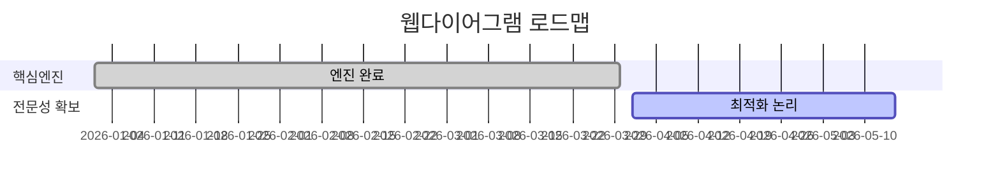
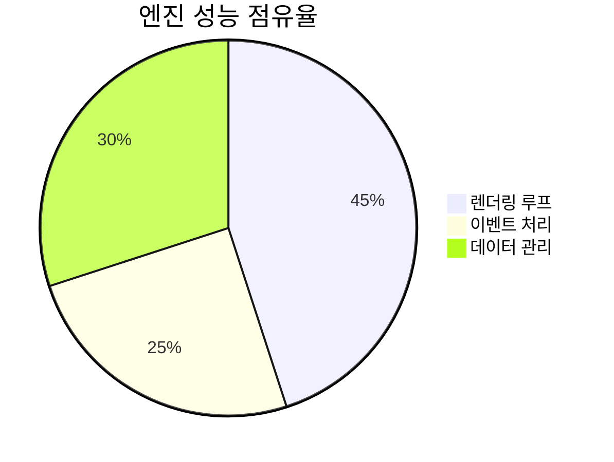
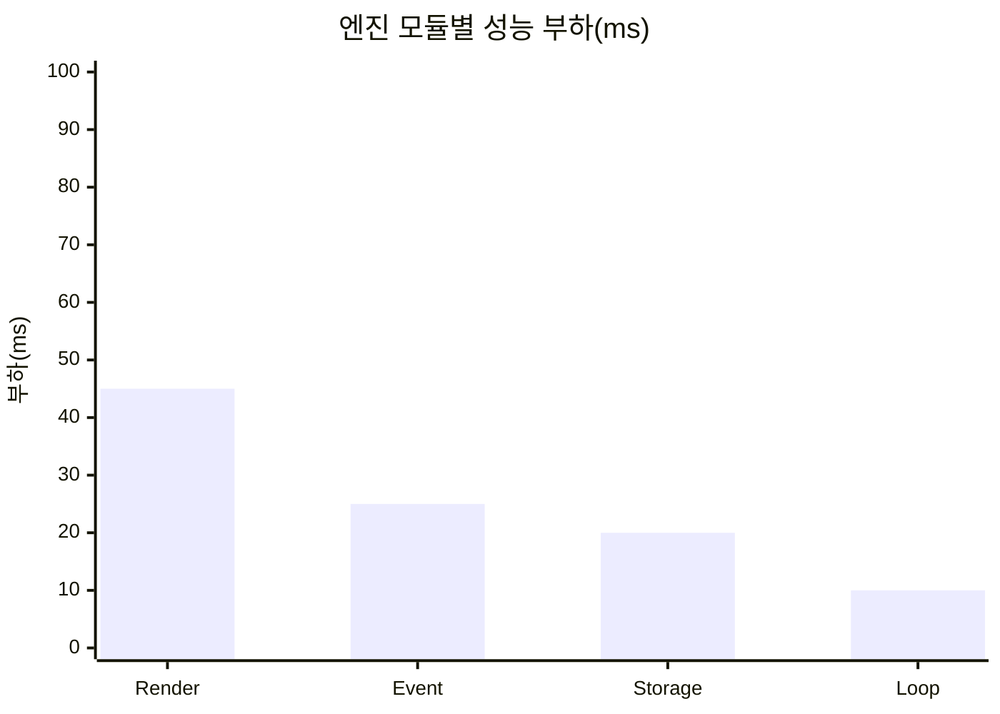

*`* 본 페이지에서는 마크다운 기본 규칙을 설명합니다.`*
<br/><br/><br/>

# 1. 수평선 긋기 `<hr />` (셋 다 동일)
1. --- 
2. ***
3. ___

# 2. 글씨크기 (샾+공백+문장 입력)
- # h1
- ## h2
- ### h3
- #### h4 
- ##### h5
- ###### h6 (최소 크기)

# 3. 글씨타입
- 기본글
- ~~취소선~~
- *이탤릭*
- **볼드**
- ***볼드+이탤릭***
- `백틱 강조`
- > 인용구 (Blockquote)

# 4. 목차
- **Underwear**
    - ***Men's***
        1. Adidas
        2. BYC
        3. Nike
    - ***Women's***
        1. Calvin Klein
        2. Victoria's Secret
- **Outerwear**
    1. ...........................................

# 5. 코드블록
```typescript
const type1: string = '타입1';
let type2: null|'타입1'|'타입2' = null;
```

# 6. 앵커 `<a>` (링크주소#아이디)
1. [내부 섹션으로 이동](#under-link) 
    - <h4 id="under-link">여기로 이동합니다.</h4>

2. [외부 섹션으로 이동](../README.md#welcome-link)
    - #### /README.md#welcome-link 로 이동합니다.

# 7. 테이블
| 항목 | 설명 | 비고 |
| :--- | :---: | ---: |
| 왼쪽 정렬 | 중앙 정렬 | 오른쪽 정렬 |
| 데이터 1 | 데이터 2 | 데이터 3 |
| 데이터 4 | 데이터 5 | 데이터 6 |

# 8. 다이어그램
1. *Top Down (TD) 방식*

2. *Left to Right (LR) 방식*

### 주요 포함 요소 설명
* `([ ])`: 알약(타원형) - 시작/종료
* `[/ /]`: 평행사변형 - 입력/출력
* `[( )]`: 원통형 - 데이터베이스
* `{ }`: 마름모 - 분기/결정
* `[ ]`: 사각형 - 일반 처리
* `--[ ]`: 노트/메모 - 주석 형태
* `<br/>`: 내용 줄바꿈

# 9. 그 외 차트들
1. *시퀀스 다이어그램*

2. *간트 차트*

3. *원형 분포도*

4. *수직 바 차트*
