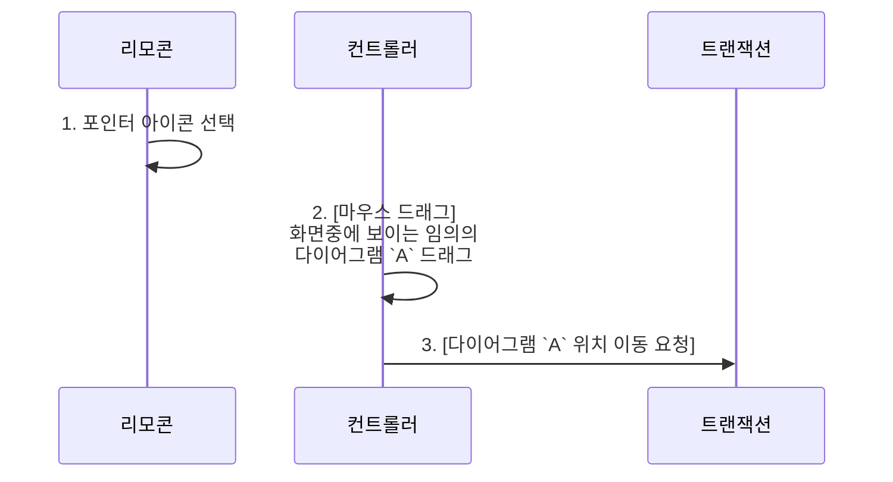
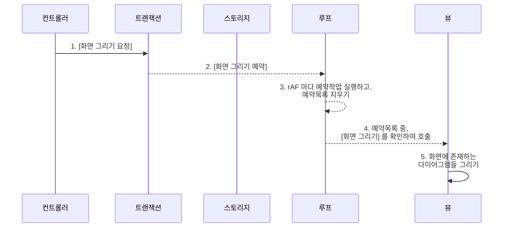
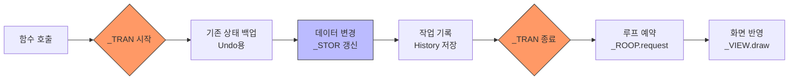

[...목록으로 가기](./index.md)

# : : : [Module] MAIN : : :

<br/>

# 기능목록
## [Logic] 마우스 드래그로 다이어그램 이동 시, 모듈들이 순서대로 하는 일.


## [Logic] 트랜잭션에서 루프로 [화면그리기] 예약 시, 모듈들이 순서대로 하는 일.




```typescript
// [Tool] 싱글톤 방식. 전역변수에 기능별 객체를 저장. (예: _STOR 는 DB저장소 역할.)
export const _DPR  = new Dpr();
export const _STOR = new Storage();
export const _TEDI = new Texteditor();

export const _SPCE = new Space();
export const _VIEW = new View({parentNode: app});
export const _CTRL = new Controller({parentNode: app});
export const _REMO = new Remocon({parentNode: app});

export const _LOOP = new Loop();
export const _TRAN = new Transaction();
export const _TEST = new Tester();
```