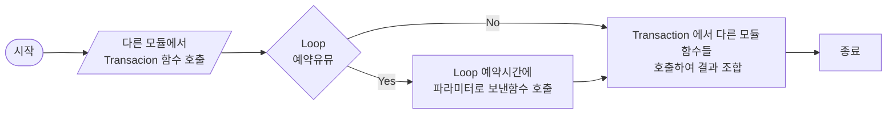
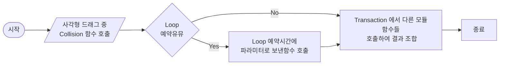

[...목록으로 가기](./index.md)

# : : : [Module] TRANSACTION : : :

 

## 기능목록
1. 메멘토 기능
    - exec
    - redo
    - undo
2. 호출기능
    - action <- 루프나 다른 모듈에서 호출 많이함
    - filter <- 필요한가 모르겠는데
    - render <- 루프나 다른 모듈에서 호출 많이함
    - collision <- 이부분은 다이어그램에게 돌려주자
3. 분별기능
    - loop 에 예약(예약명령어로 입력하면 loop에서 트랜잭션 실행함수 호출)

## Action 함수목록
`필요한 함수면 (O), 아니면 (X), 모르면 (ㅁ)`
1. (ㅁ) Init - 접속시 마지막 저장정보 로드하여 화면에 보여주는것까지 함
2. (O) LoadSpace -  화면 로드 (파라미터 space.id)
3. (O) MoveFront - 선택한 다이어그램 z-index를 맨 앞으로 가져오기
4. (O) AddDiagram - 다이어그램 추가 (파라미터 type, x, y)
5. () 

## Render 함수목록
`필요한 함수면 (O), 아니면 (X), 모르면 (ㅁ)`
1. (ㅇ) Draw - loop.draw 호출
2. (ㅁ) Resize - loop.render 호출
3. (ㅁ) zoom - loop.render 호출 

# 필요한거 정리해봐
1. 다이어그램 저장
2. 맵 저장
3. 맵 드래그로 이동
4. 

# 트랜잭션에서 할필요 없어보이는거는
1. 다이어그램.사각형 에서 편집모드 켤 때 -> 에디터 직접호출
2. 컨트롤러에서 콜리전 체크 -> 로직 만들어봐
3. 

다이어그램으로 루프와 상관관계 그려야 하는데
2. *트랜잭션 호출받았을 때 일 처리방법*

*사각형 콜리전 --> 이건 컨트롤러에서 할게 아니고 Loop로 완전 넘겨야될거같다*
*Loop에서 옵저버 형식으로 루프마다 체크한다 바람직하지 않지. 그럼 컨트롤러에서*
*매번 예약을 걸어주는건 나쁘진 않은데 매번 타겟을 넘겨주는건 컨트롤러에서 타겟이*
*루프보다 빨리 갱신되니까*
*1. 변수로 가지고 있는다: 루프에서 변수를 읽지만, 해당 시점에는 콜리전 범위 밖일 수 있어서 동시간에 콜리전 일어났을 수도 있으나 시간차로 체크값이 바뀌는 결과*
*2. 매번 파라미터로 건낸다: 컨트롤러에서 갱신한 최신 타겟과 달라서 의미 없지않나.*
*의미라고는 하나도 안빠지고 콜리전 체크는 할 수 있다. 근데 유저가 방문을 뚤고 겹쳐진 형태가 된다*
*3. Loop 안쓰고 컨트롤러 무브마다 호출해 비교: 정확하겠지만 연산량이 너무 많음*

