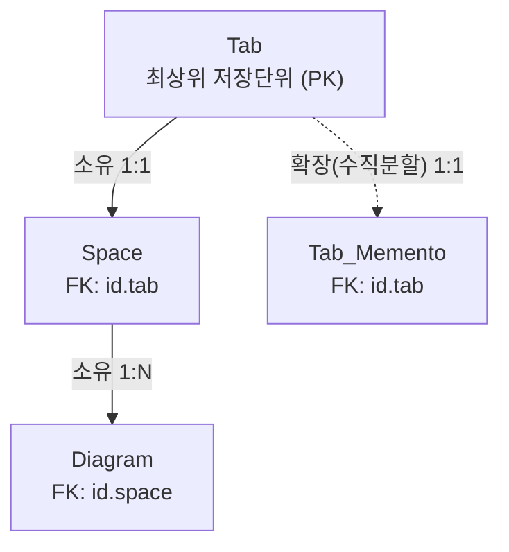

[...목록으로 가기](#)

# : : : [Guide] Schema 필드정보 및 설계서 (2026.08.19 작성) : : :
### *`* 본 페이지에서는, 해당 프로젝트의(diagram-vite2) 스키마 필드정보 및 설계규칙을 제공합니다.`*

<br/>

# 목차
### A. 스키마 목록 [#](#link-list)

1. ### [Diagram](#link-diagram)
    - ### 1-1. [Axis](#link-diagram-axis)
    - ### 1-2. [Chain](#link-diagram-chain)
    - ### 1-3. [Line](#link-diagram-line)
    - ### 1-4. [Point](#link-diagram-point)
    - ### 1-5. [Rect](#link-diagram-rect)
        - #### 1-5-1. [Memo](#link-diagram-memo)

2. ### [Space_Grid](#link-space-grid)
3. ### [Tab](#link-tab)
4. ### [Tab_Memento](#link-tab-memento)
5. ### [Settings](#link-settings)
6. ### [Log](#link-log)
7. ### [Assets](#link-assets)


### B. 모듈의 직렬화(`serialize`) 규칙 [#](#link-serialize) 
### C. 데이터 구조 그래프 [#](#link-structure) 
<hr/>
<br/><br/><br/><br/><br/><br/>


# [<span id="link-list">#</span>](#) A. 스키마 목록
<br/>

# 1. [<span id="link-diagram">Diagram</span>](#)

***설명1 :*** 맵에 표현되는 `다이어그램 요소(도형/선/메모 등)` 의 정보.  
***설명2 :*** `axis.version`으로 브라우저 여러 탭에서 같은 다이어그램 수정 시, 데이터 덮어쓰기 방지하기.

1. **문제** : 브라우저 A탭, B탭에서 동일한 스페이스 접속 후에, 같은 다이어그램을 A탭에서 수정후 B탭에서 수정할 시, 이전 A탭에서 IDB로 저장한 작업내용이 사라짐.
2. **방지 로직** : 업데이트 시 메모리의 `axis.version`과 IDB의 `axis.version`을 비교. 다르면, 브라우저 다른 탭에서 이미 수정된 것이므로 업데이트를 취소하고 새로고침을 안내함.
3. **효과** : 덕분에 사용자는 새로고침이나 재진입 전에 작업 내용을 옮겨 적을 시간을 벌 수 있음.
4. ⚠️ 다이어그램을 옮기기만 해도 업데이트 되므로, 이 충돌은 자주 발생함.

***Primary Key :*** axis.id  
***Foreign Key(수동관리) :*** parent.diagram.id → space.id (1:N)
- ⚠️ Space 삭제 시 반드시 대응하는 Diagram들도 같은 트랜잭션에서 삭제할 것.
- (구현: `deleteSpace()` 참조)
<br/>

## 1-1. [<span id="link-diagram-axis">Axis</span>](#)
> | No.   | Directory               | DataType                | Memo |
> | :---: | :---                    | :---                    | :--- | 
> | 1     | axis.id `(PK)`          | String                  | (현재) 다이어그램 ID |
> | 2     | axis.zIndex             | Number (Date.now)       | 화면에 그려질 순서 |
> | 3     | axis.version            | Number                  | ***설명2*** 참조 |
> | 4     | type                    | DiagramType.ClassName   | line, memo, point 등 |
> | 5     | parent.diagram.id `(FK)`| String                  | (부모) 다이어그램 ID |
> | 6     | parent.tab.id `(FK)`    | String                  | (현재) 탭 ID |
```
    axis.serialize = {
        axis: {
            id: String, // [Primary Key]
            zIndex: Number, // Date.now()
            version: Number, // 작업 저장마다 숫자 +1 씩 증가.
        },
        type: DiagramType.ClassName,
        parent: {
            diagram: {
                id: String, // [Foreign Key]
            },
            tab: {
                id: String, // [Foreign Key]
            },
        }
    };
```
<br/>

## 1-2. [<span id="link-diagram-chain">Chain</span>](#)
> | No.   | Directory                | DataType | Memo |
> | :---: | :---                     | :---     | :--- | 
> | 1     | chain.diagram1.id `(FK)` | String   | 연결 된 첫번째 다이어그램 ID |
> | 2     | chain.diagram1.x         | number   | 첫번째 다이어그램 x |
> | 3     | chain.diagram1.y         | number   | 첫번째 다이어그램 y |
> | 4     | chain.diagram2.id `(FK)` | String   | 연결 된 두번째 다이어그램 ID |
> | 5     | chain.diagram2.x         | number   | 두번째 다이어그램 x |
> | 6     | chain.diagram2.y         | number   | 두번째 다이어그램 y |
```
    chain.serialize = {
        axis: {...},
        chain: {
            diagram1: {
                id: String, // [Foreign Key]
                x: number,
                y: number,
            },
            diagram2: {
                id: String, // [Foreign Key]
                x: number,
                y: number,
            },
        },
    };
```
<br/>

## 1-3. [<span id="link-diagram-line">Line</span>](#)
> | No.   | Directory | DataType | Memo |
> | :---: | :---      | :---     | :--- | 
> | 1     | line.x1   | Number   | 시작점 x |
> | 2     | line.y1   | Number   | 시작점 y |
> | 3     | line.x2   | Number   | 종료점 x |
> | 4     | line.y2   | Number   | 종료점 y |
```
    line.serialize = {
        axis: {...},
        line: {
            x1: Number,
            y1: Number,
            x2: Number,
            y2: Number,
        },
    };
```
<br/>

## 1-4. [<span id="link-diagram-point">Point</span>](#)
> | No.   | Directory | DataType | Memo |
> | :---: | :---      | :---     | :--- | 
> | 1     | point.x   | Number   | 위치 x |
> | 2     | point.y   | Number   | 위치 y |
```
    point.serialize = {
        axis: {...},
        point: {
            x: Number,
            y: Number,
        },
    };
```
<br/>

## 1-5. [<span id="link-diagram-rect">Rect</span>](#)
> | No.   | Directory      | DataType | Memo |
> | :---: | :---           | :---     | :--- | 
> | 1     | rect.x         | number   | 중앙 x (left/right는 getter로 계산) |
> | 2     | rect.y         | number   | 중앙 y (top/bottom은 getter로 계산) |
> | 3     | rect.width     | number   | 가로 길이 |
> | 4     | rect.height    | number   | 세로 길이 |
```
    rect.serialize = {
        axis: {...},
        rect: {
            x     : Number,
            y     : Number,
            width : Number,
            height: Number,
        },
    };
```
<br/>

## 1-5-1. [<span id="link-diagram-memo">Memo</span>](#)
> | No.   | Directory            | DataType | Memo |
> | :---: | :---                 | :---     | :--- | 
> | 1     | memo.backgroundColor | String   | 배경 색상 |
> | 2     | memo.text            | String   | 메모 내용 |
```
    memo.serialize = {
        axis: {...},
        rect: {...},
        memo: {
            backgroundColor: String,
            text           : String,
        },
    };
```
<br/>

# 2. [<span id="link-space-grid">Space_Grid</span>](#)

***Primary Key :***  space_grid.id   
***Foreign Key(수동관리) :*** self.diagram.id → diagram.id (1:1)
- ⚠️ Tab 삭제 시 반드시 대응하는 space_grid도 같은 트랜잭션에서 삭제할 것.
> | No.   | Directory              | DataType              | Memo |
> | :---: | :---                   | :---                  | :--- | 
> | 1     | space_grid.id `(PK)`   | String                | 고유 ID |
> | 2     | space_grid.x1000       | Number                | 그리드 x좌표 (단위: 1000) |
> | 3     | space_grid.y1000       | Number                | 그리드 y좌표 (단위: 1000) |
> | 4     | children.diagram.list  | String[...diagram.id] | 자식 다이어그램 ID 목록 |
> | 5     | self.diagram.id `(FK)` | String                | 자기자신 다이어그램 ID |
```
    space_grid.serialize = {
        space_grid: {
            id: String, // [Primary Key]
            x1000: Number,
            y1000: Number,
        },
        children: {
            diagram: {
                list: String[...diagram.id], // 자식 다이어그램 목록
            },
        },
        self: {
            diagram: {
                id: String, // [Foreign Key]
            },
        },
    };
```
<br/>


# 3. [<span id="link-tab">Tab</span>](#)

***설명 :*** 탭 정보. (기본 최상위 저장단위)  
***Primary Key :*** tab.id
> | No.   | Directory               | DataType | Memo |
> | :---: | :---                    | :---     | :--- | 
> | 1     | tab.id `(PK)`           | String   | (현재) 탭 ID |
> | 2     | tab.title               | String   | 탭 제목 |
> | 3     | favorite.list           | String[] | 즐겨찾기 된 다이어그램 ID 목록 |
> | 4     | open.space.id `(FK)`    | String   | 최근 참조한 스페이스 ID |
> | 5     | open.space.x            | Number   | 최근 참조한 스페이스 x좌표 |
> | 6     | open.space.y            | Number   | 최근 참조한 스페이스 y좌표 |
```
    tab.serialize = {
        tab: {
            id: String, // [Primary Key]
            title: String,
        },
        favorite: {
            list : String[],
        },
        open: {
            space: {
                id: String, // [Foreign Key] 
                x: Number,
                y: Number,
            },
        },
    };
```
<br/>


# 4. [<span id="link-tab-memento">Tab_Memento</span>](#)

***설명 :*** 탭의 작업기록(Redo, Undo) 정보. 수정이 잦아서 Tab과 분리.  
***Primary Key :*** tab_memento.id.tab  
***Foreign Key(수동관리) :*** tab_memento.id.tab → tab.id.tab (1:1)
- ⚠️ IndexedDB는 FK 제약/cascade를 지원하지 않음.  
- Tab 삭제 시 반드시 대응하는 Tab_Memento도 같은 트랜잭션에서 삭제할 것.  
- (구현: `deleteTab()` 참조)
> | No.   | Directory                   | DataType                  | Memo |
> | :---: | :---                        | :---                      | :--- | 
> | 1     | tab_memento.id `(PK)(FK)`   | String                    | (현재) 탭 ID |
> | 2     | tab_memento.history         | TabMementoType.History[]  | 상태 저장 목록 |
```
    tab_memento.serialize = {
        tab_memento: {
            id: {
                tab  : String, // [Primary Key][Foreign Key]
            },
            history: TabMementoType.History[],
            /** 
             * @/tab_memento.type.ts 페이지 참조정보
                export interface History {
                    command : Command;
                    works   : work[];
                }
                export type Command = 'diagram' | 'space-move';
                export interface work {
                    before: DiagramsType.serialize.Union | null,
                    after : DiagramsType.serialize.Union | null,
                }
             */
        },
    };
```
<br/>


# 5. [<span id="link-settings">Settings</span>](#)

***설명 :*** 환경설정 (하나의 데이터 행 만 존재함)  
***Primary Key :*** settings.id
> | No.   | Directory                   | DataType | Memo |
> | :---: | :---                        | :---     | :--- | 
> | 1     | settings.id `(PK)`          | String   | 문자 1 (유일함) |
> | 2     | open.tab.id `(FK)`          | String   | 호출할 탭 ID |
```
    settings.serialize = {
        settings: {
            id: String, // [Primary Key],
        },
        open: {
            tab: {
                id: String, // [Foreign Key]
            },
        },
    };
```
<br/>


# 6. [<span id="link-log">Log</span>](#)

***설명 :*** 로그(오류, 경고, 확인, 업데이트)  
***Primary Key :*** log.timestamp
> | No.   | Directory            | DataType | Memo |
> | :---: | :---                 | :---     | :--- | 
> | 1     | log.timestamp `(PK)` | Number   | 저장 시간 |
> | 2     | log.code             | String   | 'error','warning','info', 'update' |
> | 3     | log.message          | String   | 로그 내용 |
```
    log.serialize = {
        log: {
            timestamp: Number, // [Primary Key]
            code     : String,
            message  : String,
        },
    };
```
<br/>


# 7. [<span id="link-assets">Assets</span>](#)

***설명 :*** 이미지, 음악파일 저장소  
***Primary Key :*** assets.id.assets
> | No.   | Directory               | DataType | Memo |
> | :---: | :---                    | :---     | :--- | 
> | 1     | assets.id.assets `(PK)` | String   | 다른곳에서 부를 ID |
> | 2     | assets.blob             | blob     | 바이너리화 된 이미지 및 음악파일 |
> | 3     | assets.filename         | String   | 파일명 |
> | 4     | assets.timestamp        | Number   | 저장 시간 |
```
    assets.serialize = {
        assets: {
            id  : {
                assets: String, // [Primary Key]
            },
            blob     : blob, 
            filename : String,
            timestamp: Number,
        },
    };
```
<br/><br/>


# [<span id="link-serialize">#</span>](#) B. 모듈의 직렬화(`serialize`) 규칙
**규칙:**
1. 모듈의 기본 속성은 자신의 `모듈명`으로 감싼다.  
2. 상속/그 외 모듈 포함시, 해당 `모듈명`으로 분리한다.  
```
    // NOTE: memo 모듈 직렬화 예시.
    
    memo.serialize = {
        axis: {...},    // 상속받은 모듈의 serialize
        square: {...},  // 상속받은 모듈의 serialize
        memo: {
            backgroundColor: String,
            text           : String,
        },
    };
```

**이유:**
1. **충돌 방지**: 여러 모듈을 합칠 때 변수명(`id`, `color` 등)이 겹쳐서 덮어씌워지는 것을 막고, 출처를 명확히 합니다.
2. **유지보수**: 나중에 스키마 규칙이 바뀌어도, 해당 모듈 블록만 수정하면 되어서, 마이그레이션(속성 옮기기)이 훨씬 쉽습니다.

<br/><br/>


# [<span id="link-structure">#</span>](#) C. 데이터 구조 그래프



- **실선 화살표**: "부모-자식" 관계. 부모(Tab, Space)가 삭제되면 자식(Space, Diagram)도 반드시 같이 삭제해야 함.
- **점선 화살표**: Tab_Memento는 자식이 아니라, Tab의 데이터를 편의상 두 파일로 나눠 저장한 것뿐임 (자주 바뀌는 데이터라 분리). 그래서 Tab이 삭제되면 같이 지워지긴 하지만, 엄밀히는 "부모-자식 삭제"가 아니라 "같은 걸 같이 지우는 것"에 가까움.


> ⚠️ IndexedDB는 관계형 DB와 달리 삭제가 자동으로 전파되지 않음. 즉, Tab을 지워도 Space나 Diagram이 저절로 지워지지 않으므로, 코드에서 직접 순서대로 지워줘야 함.
> - `deleteTab()` → Tab_Memento 직접 삭제 + `deleteSpace()` 호출
> - `deleteSpace()` → axis.id.space 기준으로 Diagram 전체 삭제

<br/><br/>